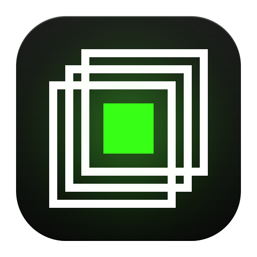

<p align="center">
  
</p>

<h1 align="center">Panes</h1>

<p align="center">
  <strong>The local-first cockpit for AI-assisted coding.</strong>
</p>

<p align="center">
  <a href="#features">Features</a> &bull;
  <a href="#getting-started">Getting Started</a> &bull;
  <a href="#development">Development</a> &bull;
  <a href="#architecture">Architecture</a> &bull;
  <a href="#contributing">Contributing</a> &bull;
  <a href="#license">License</a>
</p>

<p align="center">
  <a href="https://github.com/kevindhu/panes/releases/latest"></a>
  
  
  
  
</p>

---

Panes is a local-first desktop client for Codex. It keeps workspaces, threads, streaming output, approvals, attachments, and searchable history in one native window while Codex performs the coding work.

## Features

### Codex chat

- Streaming chat with structured content blocks for text, thinking, actions, diffs, approvals, attachments, and usage updates
- Direct integration with `codex app-server`
- Plan mode, steering, attachments, skills, apps, model and reasoning controls, and per-thread execution settings
- Interactive approval and tool-input flows, including structured questions and dynamic tool responses
- Global FTS message search with keyboard navigation
- Windowed message loading and lazy hydration for long threads/action output

### Workspaces and threads

- Local workspace and repository context with configurable trust levels
- Thread creation, rename, archive, restore, branching, rollback, and compaction
- Codex transcript synchronization and persistent SQLite history
- Workspace and thread navigation in a focused sidebar

### Desktop UX

- Native workspace and attachment pickers
- Markdown, syntax highlighting, diffs, local file links, and image previews
- App-wide zoom, native window controls, desktop completion notifications, and toast feedback
- Codex setup guidance and in-app update installation

## Getting Started

### Prerequisites

| Requirement | Version |
|---|---|
| Rust toolchain | stable |
| Node.js | 20+ |
| pnpm | 9+ |
| Codex CLI | Required for the Codex chat engine; setup can install it via npm |
| Tauri v2 prerequisites | [See Tauri docs](https://v2.tauri.app/start/prerequisites/) |

### Install on macOS

```bash
brew install --cask kevindhu/tap/panes
```

Homebrew is the primary macOS install path for prebuilt Panes releases. The macOS release is shipped as a universal app, so the same DMG works on both Apple Silicon and Intel Macs. The app updater then handles later versions in-app.

Panes is not currently signed and notarized with Apple, so Homebrew only reduces Gatekeeper friction; it does not eliminate it. The tap applies a best-effort quarantine removal step during install, but macOS may still require a manual first-launch confirmation depending on system policy. If that happens, use Finder's Open flow or download the DMG directly from [GitHub Releases](https://github.com/kevindhu/panes/releases/latest).

If Gatekeeper blocks a direct DMG install, use these commands instead of disabling Gatekeeper globally:

```bash
# If macOS blocks the downloaded DMG itself
xattr -d com.apple.quarantine ~/Downloads/Panes*.dmg
open ~/Downloads/Panes*.dmg

# After dragging Panes.app into /Applications, if first launch is blocked
xattr -dr com.apple.quarantine /Applications/Panes.app
open /Applications/Panes.app
```

Maintainers can find the tap/release automation setup in [docs/homebrew-distribution.md](./docs/homebrew-distribution.md).

### Install on Windows

Download the latest `*-setup.exe` installer from [GitHub Releases](https://github.com/kevindhu/panes/releases/latest) and run it. Later updates are delivered in-app through the Tauri updater.

For this Windows release, the validated scope is installer, updater, startup, and Codex runtime compatibility.

### Install on Linux

Download the latest `.AppImage` or `.deb` from [GitHub Releases](https://github.com/kevindhu/panes/releases/latest).

For AppImage:

```bash
chmod +x Panes*.AppImage
./Panes*.AppImage
```

For Debian-family systems:

```bash
sudo apt install ./Panes*_amd64.deb
```

Both direct-download Linux install paths receive later versions through the in-app updater. AppImage updates replace the app bundle directly. `.deb` updates reinstall the signed Debian package and may request administrator privileges during install.

Panes does not currently publish an APT repository, so the supported Debian-family install path is the direct `.deb` download above.

### Install and Run from Source

```bash
git clone https://github.com/kevindhu/panes.git
cd panes
pnpm install
pnpm tauri:dev
```

### Production Build

```bash
pnpm tauri:build
```

Common bundle artifacts include macOS DMGs/app archives, Linux DEB/AppImage outputs, and Windows NSIS installers, depending on platform and target.

## Development

```bash
pnpm tauri:dev          # full desktop app in dev mode
pnpm tauri:build        # native desktop bundles

pnpm dev                # frontend-only dev server
pnpm build              # frontend production build
pnpm test               # Vitest suite
pnpm typecheck          # TypeScript no-emit check

pnpm build:desktop          # build frontend assets, not native app bundles
pnpm prune:artifacts:check  # inspect generated artifacts that are safe to remove
pnpm prune:artifacts        # remove repo-local generated artifacts like src-tauri/target
pnpm prune:artifacts:stale:check  # inspect stale Rust/Tauri artifacts older than 7 days
pnpm prune:artifacts:stale        # remove stale Rust/Tauri artifacts older than 7 days
pnpm release:check          # evaluate whether a release should be cut
pnpm release                # run release-it
```

Rust-only:

```bash
cd src-tauri
cargo check
cargo fmt
cargo clippy
```

Generated build artifacts can grow quickly during Tauri/Rust development. `pnpm prune:artifacts` removes all repo-local generated output, while `pnpm prune:artifacts:stale` trims only Rust/Tauri artifacts older than 7 days. Both are safe to regenerate on the next build, and the stale mode also accepts `--older-than-days=<n>` if you want a different window.

### Runtime Paths

| Path | Purpose |
|---|---|
| macOS / Linux: `~/.agent-workspace/config.toml` | App configuration |
| macOS / Linux: `~/.agent-workspace/workspaces.db` | SQLite database |
| macOS / Linux: `~/.agent-workspace/logs` | App log directory |
| Windows: `%LOCALAPPDATA%\Panes\config.toml` | App configuration |
| Windows: `%LOCALAPPDATA%\Panes\workspaces.db` | SQLite database |
| Windows: `%LOCALAPPDATA%\Panes\logs` | App log directory |

### User-facing copy

User-facing frontend copy is managed with `i18next`/`react-i18next`. Treat resource updates as part of the implementation of every new feature, not as cleanup work after the UI is already built.

- Do not ship new visible UI strings hardcoded in components, dialogs, menus, toasts, or empty states
- Add or update English resource keys in `src/i18n/resources/en/`
- Reuse the existing namespace structure whenever possible
- Keep the i18n resource test passing when copy changes

## Architecture

Panes uses a React + Zustand frontend running inside a Tauri shell. The Rust backend owns persistence, Codex app-server orchestration, workspace metadata, attachment access, desktop notifications, updates, and power management.

### Stack

| Layer | Technology |
|---|---|
| Desktop framework | Tauri v2 |
| Frontend | React 19 + TypeScript 5.5 + Vite 6 |
| Styling | CSS |
| State management | Zustand 5 |
| Markdown | micromark + highlight.js |
| Diff | Custom parser and renderer |
| Database | SQLite + FTS5 |
| Agent runtime | Codex app-server |

## Contributing

Contributions are welcome. Use the pull request flow described in [CONTRIBUTING.md](./CONTRIBUTING.md).

All external changes should go through a reviewed pull request. If the change adds or edits user-facing copy, update the English resource files as part of the same change.

## License

[MIT](LICENSE)
